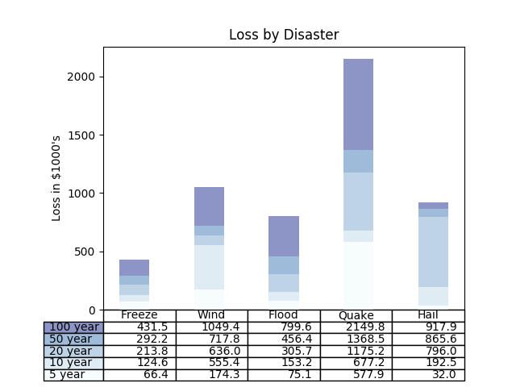

<!-- This is readme file. -->

# D3 Data-Driven Document

## What is D3

D3.js is a JavaScript library for manipulating documents based on data.

* Github: <https://github.com/d3/d3>
* API: <https://github.com/d3/d3/blob/master/API.md>
* Link: ``  

***

## Introduction

D3 allows you to bind arbitrary data to a Document Object Model (**DOM**), and then apply data-driven transformations to the document.  

>
> The Document Object Model (DOM) is a cross-platform and language-independent interface that treats an XML or HTML document as a tree structure wherein each node is an object representing a part of the document. The DOM represents a document with a logical tree. Each branch of the tree ends in a node, and each node contains objects. DOM methods allow programmatic access to the tree; with them one can change the structure, style or content of a document. Nodes can have event handlers attached to them. Once an event is triggered, the event handlers get executed.

`w3.org` has said something about [W3C stuffs: like DOM, CSS, ...](http://w3.org/TR/?tag=dom).

For example, you can **use D3 to generate an HTML table from an array of numbers** (See [Create_HTML_table_example](./Create_HTML_table_using_d3js_and_JSONCreate_HTML_Table/index.html). You may have to run it by node since it calls local json file).  

Or, use the same data to create an **interactive SVG bar chart with smooth transitions and interaction** (See [Interactive_SVG_bar_example](./Interactive_SVG_bar_chart/using_d3/index.html)).

***

## SVG

> 
> **Scalable Vector Graphics (SVG)** is an XML-based markup language for describing two dimensional based  vector graphics. SVG is essentially to graphics what HTML is to text.  
> SVG is a text-based open Web standard. It is explicitly designed to work with other web standards such as CSS, DOM, and SMIL.  
> SVG images and their related behaviors are defined in XML text files which means they can be searched, indexed, scripted and compressed. Additionally this means they can be created and edited with any text editor and with drawing software.  
> SVG is an open standard developed by the World Wide Web Consortium (W3C) since 1999.  
> Documents can be found in <https://developer.mozilla.org/en-US/docs/Web/SVG>

***

## Challenging practise

### Challenge 1

> Table Demo
>
> 
>
> An interactive demo of table function to display a table within a plot.
>
> Python dump demo is from <https://matplotlib.org/3.1.1/gallery/misc/table_demo.html#sphx-glr-gallery-misc-table-demo-py>.
>
>     import numpy as np
>     import matplotlib.pyplot as plt
>     data = [[ 66386, 174296,  75131, 577908,  32015],
>             [ 58230, 381139,  78045,  99308, 160454],
>             [ 89135,  80552, 152558, 497981, 603535],
>             [ 78415,  81858, 150656, 193263,  69638],
>             [139361, 331509, 343164, 781380,  52269]]
> 
>     columns = ('Freeze', 'Wind', 'Flood', 'Quake', 'Hail')
>     rows = ['%d year' % x for x in (100, 50, 20, 10, 5)]
> 
>     values = np.arange(0, 2500, 500)
>     value_increment = 1000
> 
>     # Get some pastel shades for the colors
>     colors = plt.cm.BuPu(np.linspace(0, 0.5, len(rows)))
>     n_rows = len(data)
> 
>     index = np.arange(len(columns)) + 0.3
>     bar_width = 0.4
> 
>     # Initialize the vertical-offset for the stacked bar chart.
>     y_offset = np.zeros(len(columns))
> 
>     # Plot bars and create text labels for the table
>     cell_text = []
>     for row in range(n_rows):
>         plt.bar(index, data[row], bar_width, bottom=y_offset, color=colors[row])
>         y_offset = y_offset + data[row]
>         cell_text.append(['%1.1f' % (x / 1000.0) for x in y_offset])
>     # Reverse colors and text labels to display the last value at the top.
>     colors = colors[::-1]
>     cell_text.reverse()
> 
>     # Add a table at the bottom of the axes
>     the_table = plt.table(cellText=cell_text,
>                           rowLabels=rows,
>                           rowColours=colors,
>                           colLabels=columns,
>                           loc='bottom')
> 
>     # Adjust layout to make room for the table:
>     plt.subplots_adjust(left=0.2, bottom=0.2)
> 
>     plt.ylabel("Loss in ${0}'s".format(value_increment))
>     plt.yticks(values * value_increment, ['%d' % val for val in values])
>     plt.xticks([])
>     plt.title('Loss by Disaster')
> 
>     plt.show()
>
